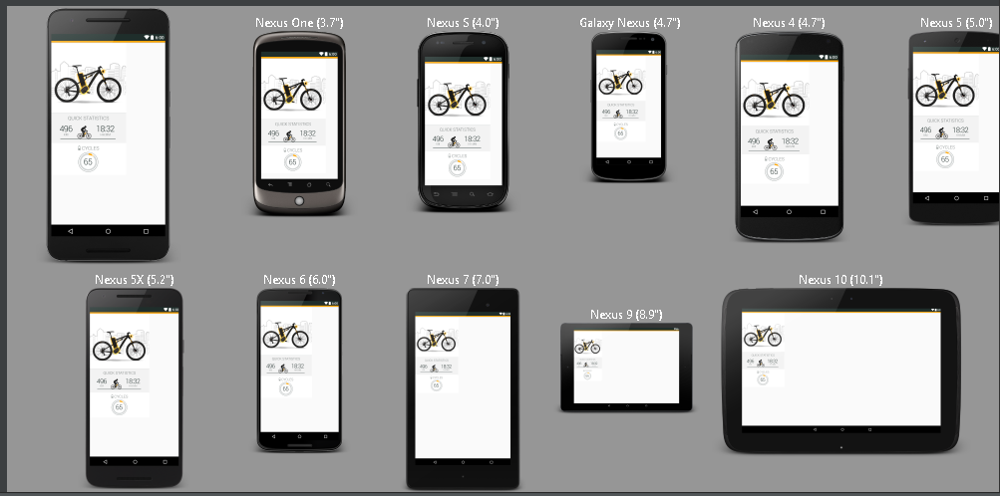
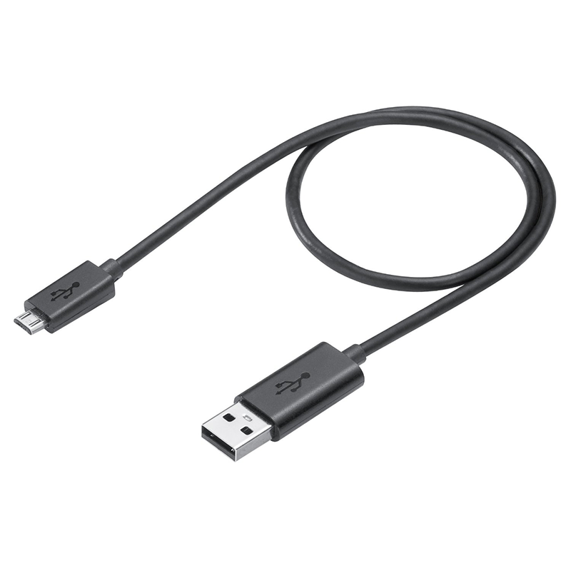
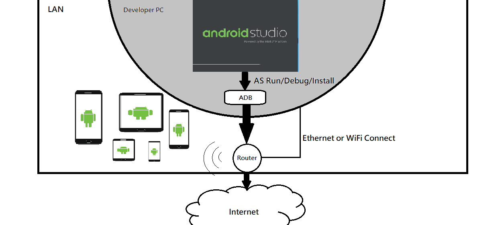

# 前言：無線Debug Android APP

　　開發Android APP時候，當你面前有n部手機要進行實機的UI測試，通常往往會發現電腦的USB插口不夠，然後你手上的USB傳輸線卻只有 1 條，難道真的只能一台 ~ 又一台 ~ 再一台手機......慢慢的Debug？先不說Debug麻煩了，你電腦的USB插口一直插插拔拔的，硬件遲早鬆脫兼加速老化。 

　　為了解決這種令人囧掉的情況，其實可以使用ADB \(Android Debug Bridge\)這個工具，結合TCP/IP方式進行Debug，你只需要對所有裝置連接USB做一次TCP/IP的連接綁定，之後就可以輕鬆直接的對多台實體機運行無線Debug了，既簡單又方便\(又酷炫?\)。

　　使用ADB工具的Command，當Android Studio運行APP的Run/Debug/Install時候，選擇\(可以多個\)已進行TCP/IP連接設定同一個LAN的裝置，接下來只需要等待APK傳輸完成並且運行Android APP即可！  
運行的環境如下圖所示：

　　當然，上面的說明簡單過頭了，後面將會示範如何用ADB進行TCP/IP連接設定並運行Android APP。每一節的最後面都會附上懶人包指令。

