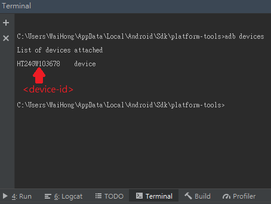
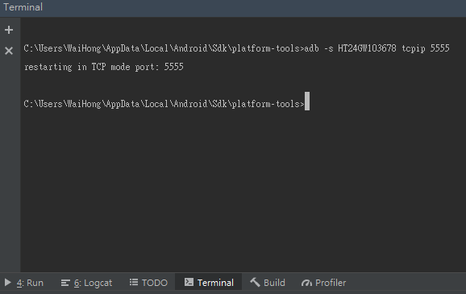
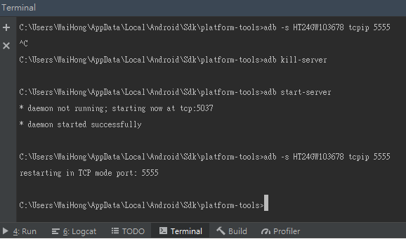
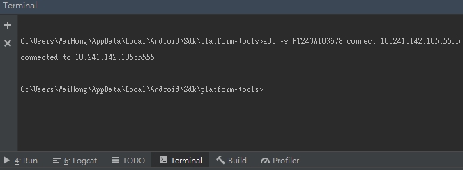
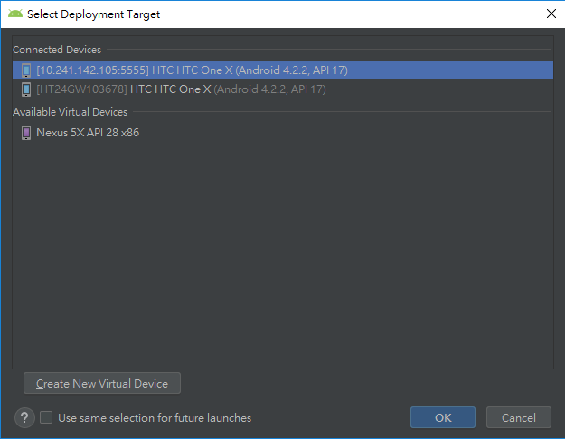
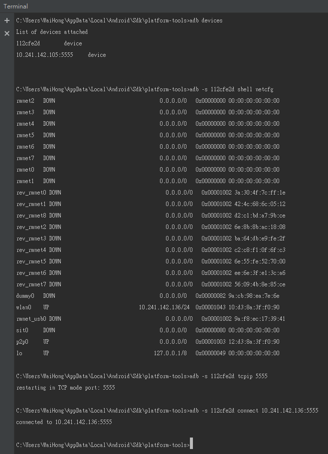
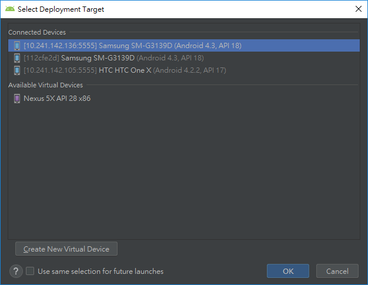
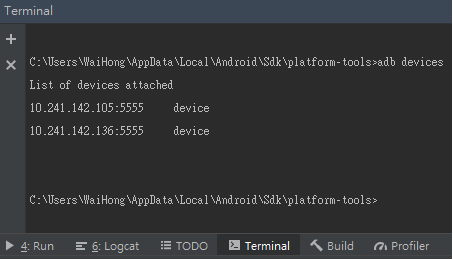
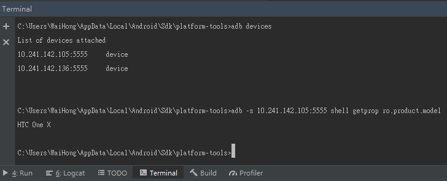

# 第三節：使用ADB指令進行TCP/IP設定多個裝置



本節參與的Android實體裝置如下：  
hTC One X  
Samsung Galaxy Ace 4


第三節開始前，請先確定以下兩點：  
1. ADB是否已正常運作，第一節已有作詳細說明，也可以參考第一節的懶人包指令。  
2. 如果曾經使用單一裝置的設定，請使用以下命令中斷所有連線，並且重新啟動ADB服務即可。

```text
adb kill-server
adb start-server
```

## 一。連接

　　請先把需要ADB進行TCP/IP連接的Android裝置，用USB連接到電腦上，然後回到Terminal視窗。  
第一步：輸入以下指令，在已連接ADB裝置列表中取得Android裝置的&lt;device-id&gt;：

```text
adb devices
```



　　指令輸入後，列表的左邊欄位是裝置&lt;device-id&gt;，右邊是裝置的類型，在上面例子中找到了hTC One X裝置的&lt;device\_id&gt;是HT24GW103678。

  
第二步：輸入以下指令，取得裝置的&lt;ip\_address&gt;：

```text
adb -s <device_id> shell netcfg
```


　　一般來說，如果裝置是使用無線連接同一個LAN，並且只有一張無線網路卡，通常是以wlan0的介面為準。在上圖顯示裝置的&lt;ip-address&gt;是10.241.142.105。

  
第三步：輸入以下指令，設定裝置需要Listen的Port做為Debug傳輸，本次設定&lt;port\_number&gt;為5555。

```text
adb -s <device_id> tcpip <port_number>
```




如果實體裝置的Port已被佔用的話，輸入的指令後會出現Loading狀態不回應。

假如裝置指定的&lt;port\_number&gt;是確定有其他協定在使用，請按Ctrl+C中止，再輸入第二步指令改用其他&lt;port\_number&gt;。

如果指定的沒有或者不確定是否有其他網路協定在使用，也請按下Ctrl+C中止，拔除USB裝置後再重新接上，輸入以下指令重新開啟ADB，再次輸入第三步指令：


```text
adb kill-server
adb start-server

//第三步的指令
db -s <device_id> tcpip <port_number>
```



第四步：當指定的&lt;port\_number&gt;設定成功後，會出現"restarting in TCP mod port: &lt;port\_number&gt;"的訊息，之後輸入以下指令，即可完成Android裝置的Wireless Debug設定，其中&lt;ip\_address&gt;就是第二步紀錄下來的IP位置：

```text
adb -s <device_id> connect <ip_address>:<port_number>
```



　　ADB成功使用TCP/IP連接裝置後，會發現這時候Run/Debug/Install專案，"Select Deployment Target"會多出現一個以IP位置命名的裝置，那就代表該Android裝置可以不用使用USB傳輸線，也可以進行Debug啦！如下圖所示：



以上就是對第一台裝置的指令設定，在下面先整理第一步至第四步的指令：

```text
//第一步：使用USB傳輸線連接Android裝置後，使用命令找出<device_id>
adb devices

//第二步：找出裝置的<ip_address>，一般是以wlan0無線介面為準。
adb -s <device_id> shell netcfg

//第三步：向指定裝置設定要進行Debug傳輸Port的<port_number>
adb -s <device_id> tcpip <port_number>

//第四步：使用ADB進行TCP/IP的裝置連線
adb -s <device_id> connect <ip_address>

//大功告成，可以拔除USB傳輸線進行Wireless Debug
```

接下來進行第二個Android裝置Samsung Galaxy Ace 4，按照上面整理的指令以及步驟，看結果如何：





到這裡為止，第二台的Samsung Galaxy Ace 4已經成功使用TCP/IP連接到ADB了，也就是說多個Android裝置的Wireless Debug的架構環境已經完成了。接下來運行HelloWolrd專案．



## 二。IP Address查詢裝置資料

　　&lt;device\_id&gt;在序列中用於識別指定的TCP/IP連接。試想一下，上面的指令都需要使用到&lt;device\_id&gt;，那你現在是否還記得每一台裝置上面的&lt;device\_id&gt;？如果你記得起來，只能說記憶力天賦異稟了，但是我就是做不到。  
其實當Android裝置執行ADB連線指令：

```text
adb -s <device_id> connect <ip_address>:<port_number>
```

然後使用：

```text
adb devices
```



　　結果發現使用TCP/IP連線的裝置，他們的&lt;device\_id&gt;都被轉換成&lt;ip\_address&gt;:&lt;port\_number&gt;。也就是說當我們需要執行某些ADB指令到指定裝置上，只需要把&lt;ip\_address&gt;:&lt;port\_number&gt;取代&lt;device\_id&gt;，ADB同樣可以識別到指定Android裝置上！



## 三。中斷連線

接下來就是，指令有connect，當然也有disconnect，指令一樣很簡單，&lt;ip\_address&gt;以及&lt;port\_number&gt;上面已經有說明，就不再細說應該都懂的：

```text
adb disconnect <ip_address>:<port_number>
```




```text
//第一步：使用USB傳輸線連接Android裝置後，使用命令找出<device_id>
adb devices

//第二步：找出裝置的<ip_address>，一般是以wlan0無線介面為準。
adb -s <device_id> shell netcfg

//第三步：向指定裝置設定要進行Debug傳輸Port的<port_number>
adb -s <device_id> tcpip <port_number>

//第四步：使用ADB進行TCP/IP的裝置連線
//注意：執行完成後，該裝置的<ip_address>:<port_number>可以取代<device_id>
adb -s <device_id> connect <ip_address>:<port_number>


/*=============================
以下是當有特殊情況下，才需要使用的命令
==============================*/

//當目標裝置的<port_number>因主線程阻塞導致沒有回應，並確定該裝置<port_number>是沒有指定程序在使用
//關閉ADB服務
adb kill-server
//開啟ADB服務
adb start-server
//重新設定目標Listen Debug Port
adb tcpip <port_pumber>

//當需要斷開裝置WiFi的Listen Debug Port，可以使用以下命令
adb disconnect <ip_address>:<port_number>
```



