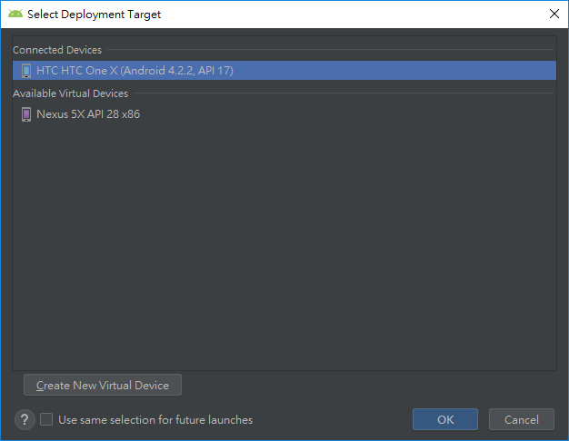
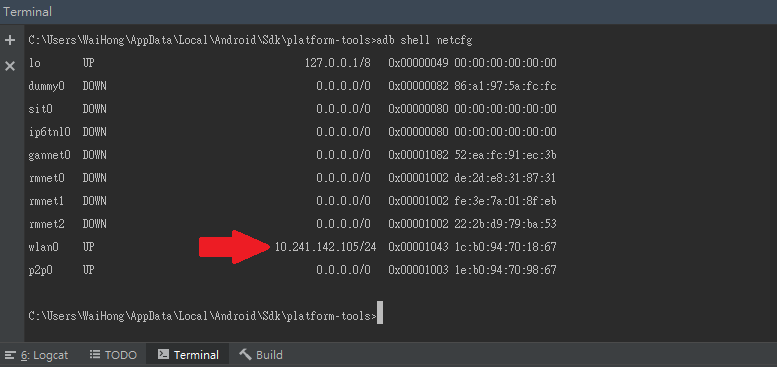
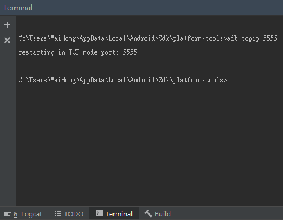
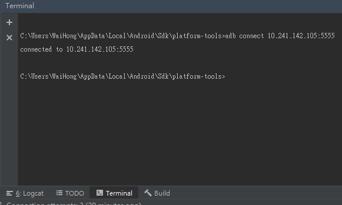
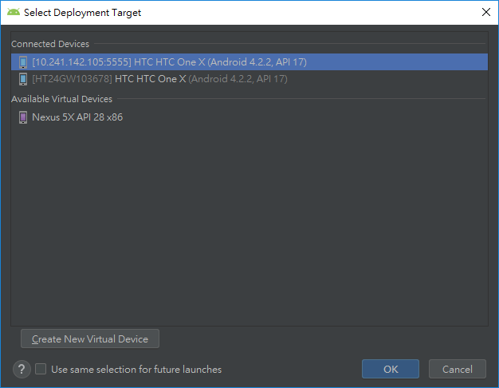
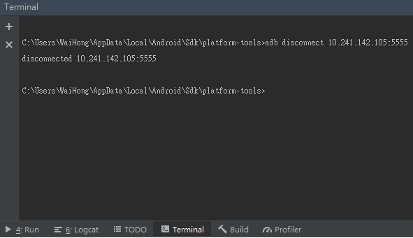
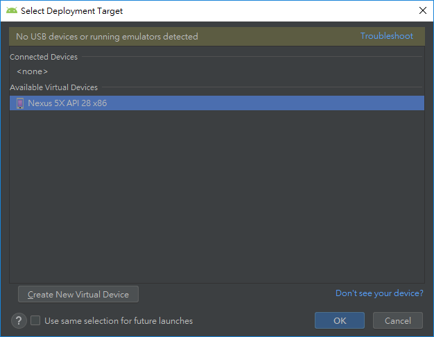
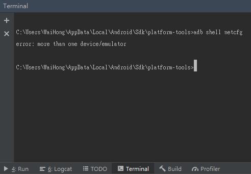

# 第二節：使用ADB指令進行TCP/IP設定單一裝置


本節參與的Android實體裝置如下：  
hTC One X


上一節檢查完ADB正常後，接下來請先把需要進行TCP/IP設定的Android裝置，用USB連接上電腦，也請確定該手機是可以正常Debug Android App的。



## 一. 連接

接下來回到Terminal視窗。  
第一步：輸入以下指令取得實體Android裝置上的&lt;ip\_address&gt;：

```text
adb shell netcfg
```



一般來說，如果裝置是使用無線連接同一個LAN，並且只有一張無線網路卡，通常是以wlan0的介面為準。在上圖顯示裝置的&lt;ip\_address&gt;是10.241.142.105。

第二步：輸入以下指令，設定裝置需要Listen的Port做為Debug傳輸，本次設定&lt;port\_number&gt;為5555。

```text
adb tcpip <port_number>
```




如果實體裝置的Port已被佔用的話，輸入的指令後會出現Loading狀態不回應。

假如裝置指定的&lt;port\_number&gt;是確定有其他網路協定在使用，請按Ctrl+C中止，再輸入第二步指令改用其他&lt;port\_number&gt;。

如果指定的&lt;port\_number&gt;沒有或者不確定是否有其他網路協定在使用，也請按下Ctrl+C中止，拔除USB裝置後再重新接上，輸入以下指令重新開啟ADB，再次輸入第二步指令：


```text
adb kill-server
adb start-server

//第二步的指令
adb tcpip <port_number>
```


第三步：當指定的&lt;port\_number&gt;設定成功後，會出現"restarting in TCP mod port: &lt;port\_number&gt;"的訊息，之後輸入以下指令，即可完成單一Android裝置的Wireless Debug設定，其中&lt;ip\_address&gt;就是第一步紀錄下來的IP位置：

```text
adb connect <ip_address>:<port_number>
```



ADB成功使用TCP/IP連接裝置後，會發現這時候Run/Debug/Install專案，"Select Deployment Target"會多出現一個以IP位置命名的裝置，那就代表該Android裝置可以不用使用USB傳輸線，也可以進行Debug啦！如下圖所示：





當你的團隊手頭上Android裝置不夠用時候，這種的Debug方式可以間接的解決裝置要借來借去測試App問題，同時開發App時候裝置也可以供他人使用，免受傳輸線綁住的困擾（當然別借到手機不見......）。

## 二. 中斷連線

接下來就是，指令有connect，當然也有disconnect，指令一樣很簡單，&lt;ip\_address&gt;以及&lt;port\_number&gt;上面已經有說明，就不再細說應該都懂的：

```text
adb disconnect <ip_address>:<port_number>
```



接下來再運行一次看看HelloWorld專案，看一下"Select Deployment Target"的視窗。



在上圖已經確定IP連線的裝置已經被中斷了，所以不再出現該裝置了。至於為甚麼連USB裝置都不見？因為我根本沒插傳輸線啊ＸＤ．

## 三. 多個裝置連線的常見問題

在這邊已完成了單一裝置連線方式的介紹，你可能會試著連接第二台Android裝置，找出它的&lt;ip\_address&gt;時候，卻跑出了以下的訊息：



其實&lt;ip\_address&gt;可以在手機的WiFi設定可以看到，使用以下指令同樣可以透過TCP/IP方式連接：

```text
adb connect <ip_address>:<port_number>
```

只是這個做法個人不太建議，因為這個概念跟寫程式時候的執行緒狀況相似，當你用以上的方式進行ADB的TCP/IP連線時候，主線程就會被阻塞，如果有需要用到adb shell查看連線狀態，還會出現以上的"error: more than one device/emulator"的錯誤。

因此，下一節將會透過裝置的序列號方式，運行ADB命令的多個WiFi裝置連線。

## 四. 懶人包指令



```text
//Android裝置使用USB傳輸線連接後，使用命令找出裝置的<ip_address>
adb shell netcfg

//設定目標Android裝置，使用自定義的<port_number>去Listen Debug Port
adb tcpip <port_number>

//對目標Android裝置進行連線
adb connect <ip_address>:<port_number>


/*=============================
以下是當有特殊情況下，才需要使用的命令
==============================*/

//當目標裝置的<port_number>因主線程阻塞導致沒有回應，並確定該裝置<port_number>沒有指定程序在使用
//關閉ADB服務
adb kill-server
//開啟ADB服務
adb start-server
//重新設定目標Listen Debug Port
adb tcpip <port_pumber>

//當需要斷開裝置WiFi的Listen Debug Port，可以使用以下命令
adb disconnect <ip_address>:<port_number>
```



