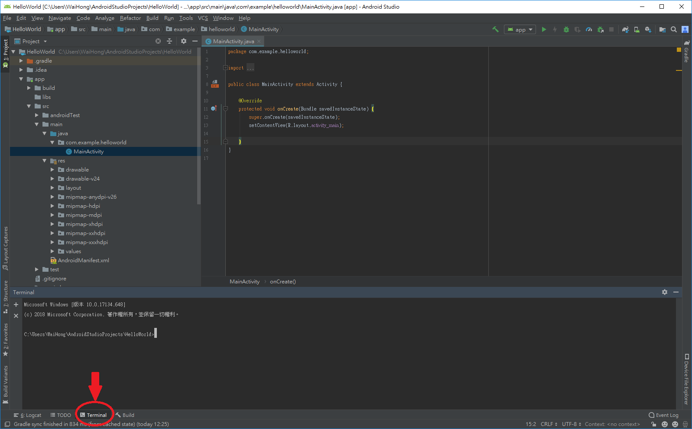
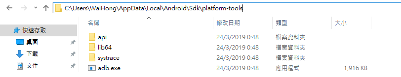
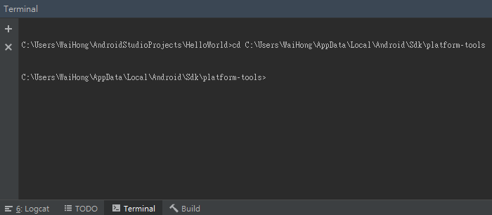
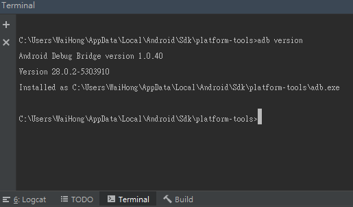

# 第一節：檢查ADB工具運作\(Windows系統環境\)

　　既然是使用Android Studio IDE工具開發，當然是需要下載Android Studio，不過這邊就先不多介紹。  
相信會來看這篇文章，都已經學會基本的Android Studio安裝及使用方法吧。  
不過還是給個下載連結好了：[https://developer.android.com/studio](https://developer.android.com/studio)

　　執行Android Studio並開啟專案後，下方有一個叫Terminal的工具，將它顯示出來。



　　Terminal畫面相信大家都不會陌生，就是熟悉Windows的cmd指令視窗。

　　接下來就是介紹本篇主角ADB \(Android Debug Bridge\)這個工具，有在開發Android App相信對這名字不會陌生，在Windows版本的Android Studio如果是使用預設安裝的話，ADB的路徑一般會放在：

```text
C:\Users\ <UserName> \AppData\Local\Android\Sdk\platform-tools
```



　　在路徑中的AppData必須要顯示隱藏檔案才會看到，在platform-tools資料夾裡面，會有一個叫adb.exe的檔案，就是我們必須要用到的工具。下一步請你把adb的路徑複製下來。回到Android Studio的Terminal畫面使用cd指令再貼上你的路徑後按Enter。

```text
cd C:\Users\ <UserName> \AppData\Local\Android\Sdk\platform-tools
```



路徑變更後可以輸入：

```text
adb version
```



　　如果成功顯示ADB的版本，代表你的ADB工具是可以正常運作的，下一步將帶領如何使用ADB指令進行對裝置TCP/IP傳輸設定。




```text
//首先取得ADB的路徑，<UserName>是你Windows使用者名稱
cd C:\Users\ <UserName> \AppData\Local\Android\Sdk\platform-tools

//檢查ADB相關指令是否能夠執行
adb version
```



